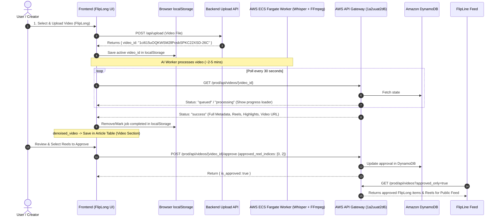

# 📱 Flipline & FlipLong — Frontend Developer Integration Guide
### Production Serverless Pipeline (AWS API Gateway Live Endpoints)

This document contains the exact production AWS API Gateway endpoints, polling workflow, JSON schemas, and frontend integration code for the **Frontend Engineering Team**.

---

## 🌐 Production Environment & Base URLs

| Environment | Base URL | Status |
| :--- | :--- | :--- |
| **AWS API Gateway (Production)** | `https://1a2uuat2d6.execute-api.us-east-1.amazonaws.com/prod` | 🟢 **ACTIVE & LIVE** |
| **Local Docker (Development)** | `http://localhost:8000` | 🟡 Optional Local Fallback |

> ⚠️ **IMPORTANT FOR FRONTEND:**  
> Use **`https://1a2uuat2d6.execute-api.us-east-1.amazonaws.com/prod`** as your `API_BASE_URL`.  
> All endpoints below are configured, live, and verified on AWS.

---

## 📑 Table of Contents
1. [Endpoints Quick Reference](#endpoints-quick-reference)
2. [User Story: The Creator & Consumer Journey](#2-user-story-the-creator--consumer-journey)
3. [End-to-End System Workflow](#3-end-to-end-system-workflow)
4. [Step 1: Video Upload & LocalStorage Persistence](#step-1-video-upload--localstorage-persistence)
5. [Step 2: Status Polling (Every 30s) & State Handling](#step-2-status-polling-every-30s--state-handling)
6. [Step 3: Storing Full Video (denoised_video) in User Article](#step-3-storing-full-video-denoised_video-in-user-article)
7. [Step 4: Reels & Highlights Approval Endpoint](#step-4-reels--highlights-approval-endpoint)
8. [Step 5: Displaying Videos in FlipLine Feed](#step-5-displaying-videos-in-flipline-feed)
9. [TypeScript Type Definitions](#typescript-type-definitions)
10. [Production React Hook (Ready to Copy-Paste)](#production-react-hook-ready-to-copy-paste)

---

## 1. Endpoints Quick Reference

| Action | Method | Exact Live URL |
| :--- | :--- | :--- |
| **Health Check** | `GET` | `https://1a2uuat2d6.execute-api.us-east-1.amazonaws.com/prod/health` |
| **Check Video Status (Polling)** | `GET` | `https://1a2uuat2d6.execute-api.us-east-1.amazonaws.com/prod/api/videos/{video_id}` |
| **Approve Reels / Highlights** | `POST` | `https://1a2uuat2d6.execute-api.us-east-1.amazonaws.com/prod/api/videos/{video_id}/approve` |
| **Get Public Feed (FlipLine)** | `GET` | `https://1a2uuat2d6.execute-api.us-east-1.amazonaws.com/prod/api/videos?limit=50&approved_only=true` |
| **Get All Videos (Studio/Admin)** | `GET` | `https://1a2uuat2d6.execute-api.us-east-1.amazonaws.com/prod/api/videos?limit=50&approved_only=false` |

---

## 2. User Story: The Creator & Consumer Journey

To understand why each endpoint, state, and UI element exists, here is the user's journey from upload to publication:

### 👤 Persona: Alex (Content Creator / Podcaster)

#### 1. 📤 Uploading in FlipLong
> *"As a creator, I have just recorded a long-form interview. I go to **FlipLong** and upload my video file."*
* **Frontend Action:** Uploads video to the backend. The backend quickly returns a `video_id`.
* **User UX:** The UI shows a friendly confirmation:  
  *“Your video has entered the AI pipeline! We are transcribing, removing noise, and extracting viral reels. This takes 2–5 minutes. You can safely refresh or leave this page without losing progress.”*
* **Safety Net:** The frontend stores `video_id` in `localStorage` so refreshing the tab won't disrupt the flow.

#### 2. ⏳ Real-Time Background Status (Polling Every 30s)
> *"While I wait, I want to see that work is actively happening."*
* **Frontend Action:** The frontend polls `GET /prod/api/videos/{video_id}` every 30 seconds.
* **User UX:** Shows a clean animated loader or progress stepper:  
  `1. Uploaded` ➔ `2. AI Audio Transcription & Noise Cancellation` ➔ `3. Detecting & Cutting Viral Reels`.

#### 3. ✍️ Creating the Article & Attaching the Master Video
> *"Processing is done! I want to write my article manually and attach my clean, branded video to it."*
* **Frontend Action:** Once the endpoint returns `status: success`, the UI receives the master `denoised_video` URL.
* **User UX:** Alex manually writes/composes his article in the dashboard. The frontend automatically links the `denoised_video` URL into the article's video section so viewers can watch the full episode with crisp sound and branding.

#### 4. 🎬 Reviewing & Approving Viral Reels
> *"The AI generated 3 vertical reels (9:16) with captions. I want to preview them and only publish the best ones."*
* **User UX:** Alex previews Reel 1, Reel 2, and Reel 3. He likes Reel 1 and Reel 3, but unchecks Reel 2.
* **Frontend Action:** Alex clicks **“Approve Selected Reels”**. The frontend sends `POST /prod/api/videos/{video_id}/approve` with `approved_reel_indices: [0, 2]`.

#### 5. 📱 Discovery on FlipLine Feed
> *"As a sports fan / consumer scrolling the **FlipLine** mobile feed, I want to discover engaging short clips."*
* **Frontend Action:** The FlipLine feed queries `GET /prod/api/videos?approved_only=true`.
* **User UX:** Consumers instantly see Alex's approved reels (Reels 1 & 3) in their feed. The unapproved Reel 2 remains hidden, ensuring only top-tier content reaches the audience!

---

## 3. End-to-End System Workflow



---

## Step 1: Video Upload & LocalStorage Persistence

> [!IMPORTANT]
> **Understanding the Two Backend URLs:**
> 1. **Main Application Backend (`MAIN_BACKEND_URL`)**: Your main app/FlipLong backend server (e.g., `POST /api/flipLong/upload_video/init`). It initializes the Google Drive Resumable Upload session and returns the `uploadUrl`.
> 2. **Flipline AI Pipeline API (`FLIPLINE_AI_URL`)**: `https://1a2uuat2d6.execute-api.us-east-1.amazonaws.com/prod`. This is our AWS Serverless engine used in Steps 2 to 5 for **status polling**, **reel approval**, and **feed retrieval**.

When the user uploads a video in **FlipLong** (using the new Direct Google Drive Upload to bypass Vercel limits):
1. **Initialize the Upload:** POST metadata to your backend (`/api/flipLong/upload_video/init`). This returns a special `uploadUrl` from Google Drive.
2. **Direct Upload:** PUT the raw file blob directly to that `uploadUrl`. This sends the large file straight to Google servers, preventing your Next.js server from crashing. Google Drive returns the `video_id` (file ID) when the PUT succeeds.
3. **Crucial Persistence:** Save this `video_id` in browser `localStorage` immediately. If the user accidentally reloads or closes the tab, the frontend reads this ID on mount and resumes polling without failing or restarting the process.

### ⚠️ Important Note for Frontend Developer (Watermarking)
When calling the \init\ endpoint, you **MUST** pass the \uthor\ (username) in the JSON body. The AI pipeline reads this name from Google Drive and renders it as a **Watermark** on the final reels and highlights. Do not leave it empty!

### JavaScript / React Example:
```javascript
// Main App Backend (where your team's video upload route lives)
const MAIN_BACKEND_URL = process.env.REACT_APP_BACKEND_URL || "https://your-main-backend.com";

// Flipline AI Serverless Pipeline (for polling, approving & feed)
const FLIPLINE_AI_URL = "https://1a2uuat2d6.execute-api.us-east-1.amazonaws.com/prod";

async function handleFlipLongUpload(file, userName, sportType) {
  // 1. Initialize Direct Resumable Upload (Bypasses Next.js limits)
  const initRes = await fetch(`${MAIN_BACKEND_URL}/api/flipLong/upload_video/init`, {
      method: 'POST',
      headers: { 'Content-Type': 'application/json' },
      body: JSON.stringify({
          fileName: file.name,
          mimeType: file.type || 'video/mp4',
          author: userName || '',
          sport: sportType || 'general',
          description: 'FlipLong User Video Drop'
      })
  });

  if (!initRes.ok) throw new Error("Init upload failed");
  const initData = await initRes.json();
  const uploadUrl = initData.uploadUrl;
  
  // 2. Upload file directly to Google Drive
  const uploadRes = await fetch(uploadUrl, {
      method: 'PUT',
      headers: {
          'Content-Type': file.type || 'video/mp4'
      },
      body: file // Direct file blob payload
  });
  
  if (!uploadRes.ok) throw new Error("Google Drive direct upload failed");

  // 3. Extract the generated video_id (Google Drive File ID)
  // When the resumable upload finishes, Google Drive returns the file metadata in the response
  const driveData = await uploadRes.json();
  const videoId = driveData.id;

  // 4. Persist in localStorage immediately to survive page refreshes
  const jobData = {
    videoId: videoId,
    fileName: file.name,
    uploadedAt: new Date().toISOString(),
    status: "queued"
  };
  localStorage.setItem("fliplong_active_job", JSON.stringify(jobData));

  // 3. Start Polling the Live AWS AI Pipeline Endpoint
  startPolling(videoId);
}
```

---

## Step 2: Status Polling (Every 30s) & State Handling

Because video denoising, Whisper AI transcription, and reel cutting take 2 to 5 minutes depending on video length, poll every **30 seconds**.

### Exact Live Endpoint:
* **Method:** `GET`
* **URL:** `https://1a2uuat2d6.execute-api.us-east-1.amazonaws.com/prod/api/videos/{video_id}`
* **Example:** `https://1a2uuat2d6.execute-api.us-east-1.amazonaws.com/prod/api/videos/1ci615uOQKWSM2llPosbSPKC22XSD-26C`
* **Headers:** `Accept: application/json`

---

### Case A: Video is Queued / Still Processing

While the worker is running, the endpoint returns HTTP 200 with:

```json
{
    "status": "completed",
    "video_id": "1ci615uOQKWSM2llPosbSPKC22XSD-26C",
    "data": {
        "created_at": "2026-09-16T02:50:54.123413Z",
        "video_id": "1ci615uOQKWSM2llPosbSPKC22XSD-26C",
        "status": "queued",
        "is_fliplong": true,
        "source": "fliplong",
        "is_approved": false,
        "file_name": "FlipLong-1.mp4",
        "queued_at": "2026-09-16T02:50:54.123413Z",
        "record_type": "video"
    }
}
```

*(Or during worker cold start before first DynamoDB write):*
```json
{
    "status": "processing",
    "video_id": "1ci615uOQKWSM2llPosbSPKC22XSD-26C",
    "message": "Video is queued or currently being processed by the AI pipeline."
}
```

#### Frontend UI Action:
* Keep polling active every 30 seconds.
* Show a loading spinner or progress bar:
  * *"AI Processing in Progress... Denoising audio & extracting viral reels."*
  * Progress steps: `1. Uploaded` ➔ `2. Transcribing with Whisper AI` ➔ `3. Generating Reels & Highlights`.

---

### Case B: Video Processing Finished (`data.status: "success"`)

When processing finishes, the same endpoint returns the complete AI analysis and Cloudinary media links:

```json
{
    "status": "completed",
    "video_id": "1ci615uOQKWSM2llPosbSPKC22XSD-26C",
    "data": {
        "created_at": "2026-09-16T02:53:24.088362Z",
        "video_id": "1ci615uOQKWSM2llPosbSPKC22XSD-26C",
        "status": "success",
        "is_fliplong": true,
        "source": "fliplong",
        "is_approved": false,
        "file_name": "FlipLong-1.mp4",
        "record_type": "video",
        "main_title": "Mastering Your 60 Second Self-Introduction",
        "summary": "In this video, Carl Kwan provides essential tips on crafting an engaging 60-second self-introduction, focusing on audience connection, personal background, and presentation goals to captivate listeners in various settings.",
        "denoised_video": "https://res.cloudinary.com/dflnsufit/video/upload/v1789527198/auto_flipline.internal/FlipLong-1_20260916_025219/FlipLong-1_branded.mp4",
        "denoised_audio": "https://res.cloudinary.com/dflnsufit/video/upload/v1789527197/auto_flipline.internal/FlipLong-1_20260916_025219/FlipLong-1_denoised_audio.mp3",
        "highlights": {
            "title": "Key Moments from Crafting Introductions",
            "reason": "These selected segments highlight critical aspects of delivering an effective self-introduction, ensuring clarity and engagement.",
            "is_approved": false,
            "caption": "Discover vital tips for creating impactful introductions. #PresentationSkills #PublicSpeaking #SelfIntroduction",
            "mp4": "https://res.cloudinary.com/dflnsufit/video/upload/v1789527197/auto_flipline.internal/FlipLong-1_20260916_025219/highlights.mp4",
            "mp3": "https://res.cloudinary.com/dflnsufit/video/upload/v1789527197/auto_flipline.internal/FlipLong-1_20260916_025219/highlights_audio.mp3",
            "segments": [
                { "start_time": 66.6, "end_time": 72.7 },
                { "start_time": 120.6, "end_time": 125.3 },
                { "start_time": 172.8, "end_time": 176.3 }
            ]
        },
        "reels": [
            {
                "title": "Craft Your Perfect Intro!",
                "start_time": 43.6,
                "end_time": 72.7,
                "reason": "This clip highlights the importance of starting strong and introducing yourself effectively.",
                "caption": "Learn the key elements of a strong self-introduction in just 60 seconds! #PublicSpeaking #PresentationTips #SelfIntro",
                "is_approved": false,
                "mp4": "https://res.cloudinary.com/dflnsufit/video/upload/v1789527197/auto_flipline.internal/FlipLong-1_20260916_025219/reel_1.mp4",
                "mp3": "https://res.cloudinary.com/dflnsufit/video/upload/v1789527197/auto_flipline.internal/FlipLong-1_20260916_025219/reel_1_audio.mp3"
            },
            {
                "title": "Engage Your Audience!",
                "start_time": 120.6,
                "end_time": 147.7,
                "reason": "This segment emphasizes the need to state your purpose and engage the audience.",
                "caption": "Discover how to connect with your audience and share your goals effectively. #AudienceEngagement #PublicSpeaking #PresentationSkills",
                "is_approved": false,
                "mp4": "https://res.cloudinary.com/dflnsufit/video/upload/v1789527197/auto_flipline.internal/FlipLong-1_20260916_025219/reel_2.mp4",
                "mp3": "https://res.cloudinary.com/dflnsufit/video/upload/v1789527197/auto_flipline.internal/FlipLong-1_20260916_025219/reel_2_audio.mp3"
            },
            {
                "title": "Nail Your Timing!",
                "start_time": 172.8,
                "end_time": 200.0,
                "reason": "This part provides practical advice on word count and pacing, crucial for effective presentations.",
                "caption": "Find out how to keep your introduction concise and impactful within 60 seconds! #Timing #PresentationTips #PublicSpeaking",
                "is_approved": false,
                "mp4": "https://res.cloudinary.com/dflnsufit/video/upload/v1789527197/auto_flipline.internal/FlipLong-1_20260916_025219/reel_3.mp4",
                "mp3": "https://res.cloudinary.com/dflnsufit/video/upload/v1789527198/auto_flipline.internal/FlipLong-1_20260916_025219/reel_3_audio.mp3"
            }
        ]
    }
}
```

---

## Step 3: Storing Full Video (`denoised_video`) in User Article

> [!NOTE]
> **Articles are added manually by the user.**  
> The frontend does not need to handle an auto-generated article file. Instead, the user manually writes/creates their article in the UI, and the frontend simply attaches the generated **`denoised_video`** URL to that article record.

In the success response, extract:
* **`data.denoised_video`**: The full-length video URL (studio noise-suppressed with branding watermark and intro/outro).

### Frontend Action:
1. Store this `denoised_video` URL into the **Article table's video section / video field**.
2. If your database schema doesn't yet have this field or the article table is missing:
   > ⚠️ **Note for Frontend:** Contact **Chandu** to map the `denoised_video` URL to the corresponding article record in your database.
3. Clean up `fliplong_active_job` from `localStorage` once processing completes.

---

## Step 4: Reels & Highlights Approval Endpoint

By default, FlipLong content has `is_approved: false`. To publish reels into the main feed, the user reviews the generated reels and triggers approval.

### Exact Live Endpoint:
* **Method:** `POST`
* **URL:** `https://1a2uuat2d6.execute-api.us-east-1.amazonaws.com/prod/api/videos/{video_id}/approve`
* **Example:** `https://1a2uuat2d6.execute-api.us-east-1.amazonaws.com/prod/api/videos/1ci615uOQKWSM2llPosbSPKC22XSD-26C/approve`
* **Headers:** `Content-Type: application/json`

### Payload Options:

#### 1. Multi-Select Approval (Recommended)
Send the zero-based indices of the reels the user checked:
```json
{
    "approved_reel_indices": [0, 2]
}
```

#### 2. Single Reel Approval
```json
{
    "reel_index": 1,
    "is_approved": true
}
```

#### 3. Highlights Approval
```json
{
    "approve_highlights": true
}
```

#### 4. Approve Everything
```json
{
    "is_approved": true
}
```
*(An empty `{}` JSON body also approves everything by default).*

---

### Response Sample:
```json
{
    "status": "success",
    "video_id": "1ci615uOQKWSM2llPosbSPKC22XSD-26C",
    "is_approved": true,
    "reels": [
        { "title": "Craft Your Perfect Intro!", "is_approved": true, "mp4": "..." },
        { "title": "Engage Your Audience!", "is_approved": false, "mp4": "..." },
        { "title": "Nail Your Timing!", "is_approved": true, "mp4": "..." }
    ],
    "highlights": {
        "title": "Key Moments from Crafting Introductions",
        "is_approved": true,
        "mp4": "..."
    },
    "message": "Approval successfully updated."
}
```

---

## Step 5: Displaying Videos in FlipLine Feed

To load videos into the **FlipLine** feed:

### Exact Live Endpoint:
* **Method:** `GET`
* **URL:** `https://1a2uuat2d6.execute-api.us-east-1.amazonaws.com/prod/api/videos?limit=50&approved_only=true`

### Query Parameters:
* `limit` (default: `50`): Maximum records to fetch.
* `approved_only`:
  * `true` (**Default for Public Feed**):
    * Videos from Watchroom / Drive (`is_fliplong: false`) are auto-approved and included.
    * Videos from FlipLong (`is_fliplong: true`) ONLY appear if `is_approved === true`, and only reels where `is_approved === true` are returned.
  * `false` (**Admin / Studio View**):
    * Returns all videos including unapproved drafts:
    * `https://1a2uuat2d6.execute-api.us-east-1.amazonaws.com/prod/api/videos?limit=50&approved_only=false`

---

## TypeScript Type Definitions

Save this as `src/types/fliplong.ts`:

```typescript
export interface HighlightSegment {
  start_time: number;
  end_time: number;
}

export interface HighlightData {
  title: string;
  reason: string;
  caption: string;
  is_approved: boolean;
  mp4: string;
  mp3: string;
  segments: HighlightSegment[];
}

export interface ReelItem {
  title: string;
  caption: string;
  reason: string;
  start_time: number;
  end_time: number;
  is_approved: boolean;
  mp4: string;
  mp3: string;
}

export interface ProcessedVideoData {
  video_id: string;
  file_name: string;
  record_type: 'video';
  source: 'fliplong' | 'watchroom_drive';
  is_fliplong: boolean;
  is_approved: boolean;
  status: 'queued' | 'processing' | 'success' | 'failed';
  created_at: string;
  queued_at?: string;
  main_title?: string;
  summary?: string;
  denoised_video?: string;
  denoised_audio?: string;
  highlights?: HighlightData;
  reels?: ReelItem[];
}

export interface VideoStatusApiResponse {
  status: 'completed' | 'processing' | 'error';
  video_id: string;
  message?: string;
  data?: ProcessedVideoData;
}

export interface ApprovePayload {
  is_approved?: boolean;
  reel_index?: number;
  approved_reel_indices?: number[];
  approve_highlights?: boolean;
}
```

---

## Production React Hook (Ready to Copy-Paste)

Save this as `useFlipLongJob.ts`:

```typescript
import { useState, useEffect, useCallback, useRef } from 'react';
import { ProcessedVideoData, VideoStatusApiResponse } from './types/fliplong';

// Live AWS API Gateway Base URL
const DEFAULT_API_BASE = 'https://1a2uuat2d6.execute-api.us-east-1.amazonaws.com/prod';
const STORAGE_KEY = 'fliplong_active_job';
const POLLING_INTERVAL_MS = 30000; // 30 seconds

export function useFlipLongJob(baseUrl: string = DEFAULT_API_BASE) {
  const [activeVideoId, setActiveVideoId] = useState<string | null>(null);
  const [videoData, setVideoData] = useState<ProcessedVideoData | null>(null);
  const [isProcessing, setIsProcessing] = useState<boolean>(false);
  const [error, setError] = useState<string | null>(null);
  const timerRef = useRef<NodeJS.Timeout | null>(null);

  // 1. On Mount: Restore active job from localStorage if user reloaded page
  useEffect(() => {
    const saved = localStorage.getItem(STORAGE_KEY);
    if (saved) {
      try {
        const parsed = JSON.parse(saved);
        if (parsed.videoId && parsed.status !== 'success') {
          setActiveVideoId(parsed.videoId);
          setIsProcessing(true);
        }
      } catch (e) {
        localStorage.removeItem(STORAGE_KEY);
      }
    }
  }, []);

  // 2. Register new upload
  const registerUpload = (videoId: string, fileName: string) => {
    const job = { videoId, fileName, status: 'queued', timestamp: Date.now() };
    localStorage.setItem(STORAGE_KEY, JSON.stringify(job));
    setActiveVideoId(videoId);
    setIsProcessing(true);
    setError(null);
  };

  // 3. Status Polling Logic
  const checkStatus = useCallback(async (vid: string) => {
    try {
      const res = await fetch(`${baseUrl}/api/videos/${vid}`, {
        headers: { 'Accept': 'application/json' }
      });
      if (!res.ok) throw new Error(`HTTP Error ${res.status}`);

      const json: VideoStatusApiResponse = await res.json();
      const currentData = json.data;

      if (currentData) {
        setVideoData(currentData);

        // Check if worker finished
        if (currentData.status === 'success') {
          setIsProcessing(false);
          localStorage.removeItem(STORAGE_KEY);
          if (timerRef.current) clearInterval(timerRef.current);
        }
      }
    } catch (err: any) {
      console.error('Polling error:', err);
      setError(err.message || 'Error checking video status');
    }
  }, [baseUrl]);

  // 4. Polling Lifecycle
  useEffect(() => {
    if (!activeVideoId || !isProcessing) return;

    checkStatus(activeVideoId);

    timerRef.current = setInterval(() => {
      checkStatus(activeVideoId);
    }, POLLING_INTERVAL_MS);

    return () => {
      if (timerRef.current) clearInterval(timerRef.current);
    };
  }, [activeVideoId, isProcessing, checkStatus]);

  // 5. Approve Reels
  const approveReels = async (approvedIndices: number[]) => {
    if (!activeVideoId) return;
    const res = await fetch(`${baseUrl}/api/videos/${activeVideoId}/approve`, {
      method: 'POST',
      headers: { 'Content-Type': 'application/json' },
      body: JSON.stringify({ approved_reel_indices: approvedIndices })
    });
    const updated = await res.json();
    return updated;
  };

  return {
    activeVideoId,
    videoData,
    isProcessing,
    error,
    registerUpload,
    approveReels,
    clearActiveJob: () => {
      localStorage.removeItem(STORAGE_KEY);
      setActiveVideoId(null);
      setVideoData(null);
      setIsProcessing(false);
    }
  };
}
```

---

## 📌 Summary Checklist for Frontend Dev
- [x] Set Base URL to: `https://1a2uuat2d6.execute-api.us-east-1.amazonaws.com/prod`
- [x] On upload ➔ Store returned `video_id` in `localStorage.setItem('fliplong_active_job', ...)`.
- [x] Mount hook on page load to resume polling if page is refreshed.
- [x] Poll `GET https://1a2uuat2d6.execute-api.us-east-1.amazonaws.com/prod/api/videos/{video_id}` every 30 seconds until `data.status === "success"`.
- [x] When success:
  - Save `denoised_video` URL into the Article table video section (Contact Chandu if needed).
  - Render preview player with `highlights.mp4` and `reels` list.
- [x] Call `POST https://1a2uuat2d6.execute-api.us-east-1.amazonaws.com/prod/api/videos/{video_id}/approve` when user approves reels.
- [x] In FlipLine feed, fetch `GET https://1a2uuat2d6.execute-api.us-east-1.amazonaws.com/prod/api/videos?limit=50&approved_only=true` to display approved content.
