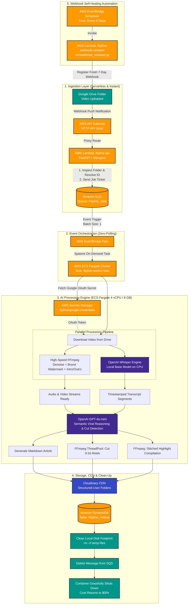

# 🎬 Flipline — Autonomous AI Video Extraction & Serverless Engine

[](https://www.python.org/)
[](https://aws.amazon.com/)
[](https://fastapi.tiangolo.com/)
[](https://www.docker.com/)
[](https://github.com/openai/whisper)
[](https://openai.com/)
[](https://ffmpeg.org/)
[](https://cloudinary.com/)
[](https://aws.amazon.com/dynamodb/)

**Developed by**: Dinod Imanjith | Associate AI Engineer  
**Architecture**: 100% Serverless, Event-Driven, Zero-Idle-Cost Cloud Infrastructure

---

## 🌟 Overview

**Flipline** is an enterprise-grade autonomous AI video intelligence pipeline. It continuously ingests long-form video content (such as podcast episodes, keynote speeches, and webinars) directly from Google Drive, and automatically produces:

1. **Engaging Short-Form Viral Reels (9:16 format)**: Algorithmically identified by semantic LLM reasoning with automated vertical cropping, caption overlays, and brand watermarking.
2. **Key Highlight Compilations**: Concatenated highlight reels showcasing the most impactful moments of the interview.
3. **Studio-Quality Denoised Media**: Background noise suppression (`afftdn`), branded intro/outro video concatenation, and high-bitrate MP3 audio extraction.
4. **Editorial Markdown Articles**: Comprehensive structured articles summarizing the core discussion themes and actionable takeaways.
5. **Instant CDN Delivery & Persistence**: All artifacts are uploaded directly to **Cloudinary CDN** and cataloged in **Amazon DynamoDB** for instant retrieval on client dashboards.

The entire infrastructure runs on a **zero-idle-cost serverless architecture** on AWS. When no videos are uploaded, compute costs are **$0.00**.

---

## 📐 End-to-End System Architecture

The pipeline uses a modern event-driven design combining **Google Drive Push Notifications (Webhooks)**, **AWS API Gateway**, **AWS Lambda**, **Amazon SQS**, **Amazon EventBridge Pipes**, and **AWS ECS Fargate**.



---

## ⚡ Key Architectural Innovations

### 1. Zero-Idle Cost Serverless Lifecycle
- **No Idle EC2 Instances**: Traditional video workers keep expensive GPU/CPU servers running 24/7. Flipline maintains **zero running instances** when idle.
- **On-Demand Fargate Invocation**: When a message hits SQS, EventBridge Pipes immediately launches a dedicated Fargate worker container. Once processing, CDN upload, and DB writes are complete, the container safely terminates.

### 2. High-Performance Parallel Media Pipeline
- **Raw FFmpeg Optimization**: Replaced slow Python-based video libraries with low-level, parallelized FFmpeg commands managed via `ThreadPoolExecutor` and `asyncio.gather()`.
- **Parallel Transcription & Branding**: Video noise cancellation, watermark branding, and audio transcription execute concurrently, slashing end-to-end processing time by **over 50%**.

### 3. Pre-Baked Whisper Weights in Multi-Stage Docker
- The Whisper AI `base` model weights are **pre-downloaded during Docker image build time** into `/root/.cache/whisper`.
- Eliminates multi-minute cold-start delays and makes container startup completely independent of external weight-download network bottlenecks.

### 4. Semantic LLM Reasoning (GPT-4o-mini)
- Eliminates brittle audio-peak or silence-detection algorithms.
- Context-aware LLM analyzes the semantic narrative of the transcript to identify self-contained, high-retention hooks strictly between 20 to 30 seconds.

### 5. Self-Healing Webhook Infrastructure
- Google Drive Push Notification channels expire after **7 days**.
- Flipline includes an **AWS EventBridge Scheduler** rule running every 6 days to automatically invoke the `flipline-webhook-renewer` Lambda, guaranteeing uninterrupted production operation without manual intervention.

### 6. Cloud Secrets Management
- Sensitive Google Drive Service Account credentials (`credentials.json`) are stored securely in **AWS Secrets Manager**.
- Neither Docker images nor Lambda ZIP archives contain raw credentials, satisfying strict SOC2 and cloud security best practices.

---

## 🛠️ Technology Stack

| Domain | Technology | Purpose |
| :--- | :--- | :--- |
| **Compute & Containers** | AWS ECS Fargate, AWS Lambda, Docker | Serverless on-demand execution for worker and API |
| **Messaging & Events** | Amazon SQS, EventBridge Pipes, EventBridge Scheduler | Decoupled queuing, automated triggers, and webhook renewal |
| **API & Webhook Ingestion** | AWS API Gateway (HTTP API), FastAPI, Mangum | Public endpoint integration and ASGI serverless adapter |
| **AI Transcription** | OpenAI Whisper (`base` model, local CPU execution) | High-accuracy timestamped audio transcription |
| **Semantic Reasoning** | OpenAI GPT-4o-mini | Viral moment identification, title, caption, and article generation |
| **Media Engineering** | FFmpeg 6+, `afftdn` audio filter, `libx264`, `aac` | Video denoising, watermark overlay, 9:16 vertical crop, audio extraction |
| **CDN & Storage** | Cloudinary CDN | High-performance multi-cloud asset hosting and delivery |
| **Database** | Amazon DynamoDB (`Flipline_Videos` table) | Persistent NoSQL storage with Global Secondary Index (`ByDateIndex`) |
| **Secrets & Security** | AWS Secrets Manager, IAM Roles | Secure credential management and least-privilege cloud security |

---

## 📁 Repository Structure

```
├── .dockerignore                 # Excludes credentials, test data, and local builds
├── .env                          # Local and cloud environment variables (git-ignored)
├── Docker/
│   └── Dockerfile                # Multi-stage Dockerfile (Builder -> Model Cacher -> Lean Runtime)
├── deploy_worker.sh              # 1-Click build, tag, and push automation script for AWS ECR
├── docker-compose.yml            # Local development orchestration (FastAPI + Worker)
├── requirements.txt              # Production Python package dependencies
├── api.py                        # FastAPI endpoints + AWS Lambda Mangum handler
├── app.py                        # Alternative entrypoint / local development runner
├── log.py                        # Standardized structured JSON logging configuration
├── register_webhook.py           # CLI utility for one-time Google Drive webhook registration
├── src/
│   ├── worker.py                 # Core SQS Fargate worker (processes 1 video and terminates)
│   ├── webhook_renewer.py        # Lambda handler invoked every 6 days by EventBridge Scheduler
│   ├── ingestion.py              # Ingests video & extracts noise-suppressed audio
│   ├── transcription.py          # OpenAI Whisper model loader and transcription engine
│   ├── ai_logic.py               # GPT-4o-mini prompt engineering & viral extraction logic
│   ├── video_editor.py           # FFmpeg parallel vertical reel cropping (9:16) & highlights
│   ├── article_generator.py      # Automated Markdown summary and article builder
│   ├── cloudinary_storage.py     # Cloudinary asset upload & local storage cleanup
│   └── utils/
│       ├── db_utils.py           # DynamoDB client (float-to-Decimal conversion, queries)
│       ├── drive_utils.py        # Google Drive API downloader + Secrets Manager integration
│       └── ffmpeg_utils.py       # Reusable FFmpeg command builder for intro/outro/watermarking
├── media/video/                  # Source intro (`start.mp4`) and outro (`end.mp4`) assets
├── logo/                         # Source watermark brand images
└── data/                         # Ephemeral runtime directories (input/, output/, temp/)
```

---

## ⚙️ Environment Variables (`.env`)

Create a `.env` file in the root directory:

```env
# ========================================================
# AI Services Configuration
# ========================================================
OPENAI_API_KEY=sk-proj-your-openai-api-key-here

# ========================================================
# Cloudinary CDN Configuration
# ========================================================
CLOUDINARY_CLOUD_NAME=your_cloud_name
CLOUDINARY_API_KEY=your_api_key
CLOUDINARY_API_SECRET=your_api_secret

# ========================================================
# Google Drive Folder IDs & Webhook Token
# ========================================================
GDRIVE_INPUT_FOLDER_ID=1f-WCZqbKkQfzXAClTXT_BaWCinD6skr1
GDRIVE_ARCHIVE_FOLDER_ID=1VAnelO9VFFlG6zOJOHrVlVYIT_I4t6xh
PUBLIC_WEBHOOK_TOKEN=mySecretToken_flipline_2026
PUBLIC_API_URL=https://your-api-id.execute-api.us-east-1.amazonaws.com/prod

# ========================================================
# AWS Cloud Infrastructure
# ========================================================
AWS_DEFAULT_REGION=us-east-1
AWS_ACCESS_KEY_ID=your_aws_access_key
AWS_SECRET_ACCESS_KEY=your_aws_secret_key
AWS_SQS_QUEUE_URL=https://sqs.us-east-1.amazonaws.com/YOUR_ACCOUNT_ID/Flipline_Jobs
GOOGLE_CREDENTIALS_SECRET_ARN=arn:aws:secretsmanager:us-east-1:YOUR_ACCOUNT_ID:secret:flipline/google-credentials-xxxxxx
```

---

## 🚀 Complete Deployment Guide

### Phase 1: AWS Console Infrastructure Setup

1. **IAM Roles**:
   - `flipline-lambda-role`: Attach `AWSLambdaBasicExecutionRole`, `AmazonSQSFullAccess`, `AmazonDynamoDBFullAccess`, and `SecretsManagerReadWrite`.
   - `flipline-ecs-task-role`: Attach `AmazonSQSFullAccess`, `AmazonDynamoDBFullAccess`, `SecretsManagerReadWrite`, and `CloudWatchLogsFullAccess`.
   - `ecsTaskExecutionRole`: Attach `AmazonECSTaskExecutionRolePolicy` and `AmazonEC2ContainerRegistryReadOnly`.
2. **Secrets Manager**:
   - Create a new secret named `flipline/google-credentials`.
   - Paste the raw contents of your `credentials.json` (Google Service Account key) into the Plaintext tab.
   - Note down the **Secret ARN** and place it in `.env` as `GOOGLE_CREDENTIALS_SECRET_ARN`.
3. **SQS Queue**:
   - Create a Standard queue named `Flipline_Jobs`.
   - Set **Visibility Timeout** to `3600` seconds (1 hour to allow full processing).
   - Set **Receive message wait time** to `5` seconds (Long polling).
   - Note down the **Queue URL** and place it in `.env` as `AWS_SQS_QUEUE_URL`.
4. **ECR Repository**:
   - Create a private repository named `flipline-worker`.
5. **ECS Cluster & Task Definition**:
   - Create a Fargate cluster named `Flipline-Cluster`.
   - Create a task definition named `flipline-worker-task`:
     - **CPU**: `4 vCPU` (Recommended for rapid CPU Whisper inference) or `1 vCPU`.
     - **Memory**: `8 GB` (or `4 GB`).
     - **Task Role**: `flipline-ecs-task-role`.
     - **Execution Role**: `ecsTaskExecutionRole`.
     - **Image URI**: `<account_id>.dkr.ecr.us-east-1.amazonaws.com/flipline-worker:latest`.
     - **Log Driver**: `awslogs` pointing to `/ecs/flipline-worker`.
     - **Environment Variables**: Add all `.env` variables.
6. **EventBridge Pipe**:
   - Create a Pipe connecting **SQS** (`Flipline_Jobs`, Batch size: `1`) to **ECS Task** (`Flipline-Cluster`, `flipline-worker-task`).
   - Under Networking, ensure **Assign Public IP** is **ENABLED** (required for Internet/S3/Cloudinary access).
7. **DynamoDB Table**:
   - Create a table named `Flipline_Videos` with Partition Key: `video_id` (String).
   - Add a Global Secondary Index (GSI):
     - Index Name: `ByDateIndex`
     - Partition Key: `record_type` (String)
     - Sort Key: `created_at` (String)

---

### Phase 2: Build & Push Worker Container (`deploy_worker.sh`)

Whenever you make updates to worker code or dependencies, run the automated deployment script from your terminal (WSL / Bash / Git Bash):

```bash
# Make the deployment script executable (first time only)
chmod +x deploy_worker.sh

# Run the 1-click build and push script
./deploy_worker.sh
```

**What this script does automatically:**
1. Dynamically detects your active AWS Account ID using `aws sts get-caller-identity`.
2. Authenticates your local Docker daemon with AWS ECR.
3. Builds the optimized multi-stage Docker image (`flipline-worker`).
4. Tags the image with the official ECR repository URI.
5. Pushes the image to Amazon ECR.

> 💡 **Next Event:** The moment an SQS message arrives, EventBridge Pipe will immediately launch this latest image version.

---

### Phase 3: Package & Deploy AWS Lambda Functions

Both the API handler and the Webhook Renewer are deployed from a single packaged zip file:

```powershell
# In Windows PowerShell:
Remove-Item -Recurse -Force lambda_package, lambda_deployment.zip -ErrorAction SilentlyContinue
pip install -r requirements.txt -t lambda_package/ --quiet
Copy-Item -Recurse src lambda_package/src
Copy-Item api.py lambda_package/
Copy-Item log.py lambda_package/ -ErrorAction SilentlyContinue
Compress-Archive -Path lambda_package\* -DestinationPath lambda_deployment.zip -Force
```

1. **Deploy API Lambda (`flipline-api`)**:
   - Upload `lambda_deployment.zip` to the function.
   - Set Handler to: `api.lambda_handler`.
   - Set Memory to `512 MB` and Timeout to `30 seconds`.
   - Add environment variables (`AWS_SQS_QUEUE_URL`, `PUBLIC_WEBHOOK_TOKEN`, `GDRIVE_INPUT_FOLDER_ID`, etc.).
2. **Deploy API Gateway**:
   - Create an HTTP API with integration pointing to `flipline-api`.
   - Set Route: `ANY /{proxy+}`.
   - Stage: `prod`.
   - Save the **Invoke URL** (e.g. `https://xxx.execute-api.us-east-1.amazonaws.com/prod`).
3. **Deploy Webhook Renewer Lambda (`flipline-webhook-renewer`)**:
   - Upload the same `lambda_deployment.zip`.
   - Set Handler to: `src.webhook_renewer.lambda_handler`.
   - Add environment variable `PUBLIC_API_URL` pointing to your API Gateway URL.
4. **Setup EventBridge Scheduler**:
   - Schedule pattern: Recurring Rate-based schedule every `6 days`.
   - Target: AWS Lambda Invoke -> `flipline-webhook-renewer`.

---

### Phase 4: Initial Google Drive Webhook Registration

Run the registration utility once to start listening for Google Drive uploads:

```bash
python register_webhook.py
```
Paste your API Gateway URL when prompted (e.g. `https://xxx.execute-api.us-east-1.amazonaws.com/prod`).

---

## 🧪 Local Testing & Development

### 1. Running Locally with Docker Compose

To test the entire stack locally without deploying to AWS:

```bash
docker compose up --build
```
- API server will be accessible at: `http://localhost:8000`
- Worker listens and consumes jobs.
- Healthcheck endpoint: `GET http://localhost:8000/health`

### 2. Manual End-to-End Pipeline Trigger

To test the Fargate worker directly without waiting for Google Drive notifications, inject a test ticket directly into your SQS queue:

```bash
aws sqs send-message \
  --queue-url "https://sqs.us-east-1.amazonaws.com/YOUR_ACCOUNT_ID/Flipline_Jobs" \
  --message-body '{"file_id": "YOUR_GDRIVE_FILE_ID", "file_name": "interview_sample.mp4", "email": "test@flipline.io"}'
```

### 3. Monitoring Live Worker Logs

Follow real-time CloudWatch output from the running Fargate worker:

```bash
aws logs tail /ecs/flipline-worker --follow
```

### 4. Fetching Processed Videos via REST API

The client dashboard fetches cataloged outputs via the REST endpoint:

```bash
curl -X GET "https://YOUR_API_GATEWAY_URL/prod/api/videos?limit=20"
```

Sample JSON output:
```json
{
  "status": "success",
  "data": [
    {
      "video_id": "1A2B3C4D5E",
      "created_at": "2026-09-04T07:30:00Z",
      "status": "success",
      "main_title": "The Future of Generative Agents in Video Production",
      "summary": "In this deep dive, industry experts discuss the shift towards serverless video extraction pipelines...",
      "denoised_video": "https://res.cloudinary.com/demo/video/upload/v1/branding_denoised.mp4",
      "denoised_audio": "https://res.cloudinary.com/demo/raw/upload/v1/audio.mp3",
      "article_path": "https://res.cloudinary.com/demo/raw/upload/v1/article.md",
      "reels": [
        {
          "title": "Why Serverless Beats Dedicated GPU Instances",
          "caption": "Cutting cloud idle costs down to zero with EventBridge and Fargate #AI #Cloud",
          "start_time": 142.5,
          "end_time": 168.2,
          "mp4": "https://res.cloudinary.com/demo/video/upload/v1/reel_1.mp4",
          "mp3": "https://res.cloudinary.com/demo/raw/upload/v1/reel_1.mp3"
        }
      ]
    }
  ]
}
```

---

## 💰 Cost & Resource Optimization Analysis

### Fargate Specifications (4 vCPU / 8 GB RAM)
For high-throughput video processing, we recommend **4 vCPU and 8 GB RAM** for the Fargate task:
- **Local Whisper `base` Model Speed**: Transcribes a 15-minute interview in ~45–60 seconds on 4 vCPUs.
- **Cost Comparison**:
  - AWS Fargate (4 vCPU / 8 GB) costs **~$0.0033 per minute** of active processing.
  - A 10-minute video process takes ~3 minutes on Fargate = **~$0.01 per processed video**.
  - OpenAI Whisper API costs **$0.006 per audio minute** ($0.06 for 10 min) — making local CPU Whisper on Fargate **~6x to 7x cheaper** than external API transcription!
  - Idle Cost = **$0.00** (containers shut down the second the job completes).

---

## 🛡️ Reliability & Fault Tolerance

- **SQS Visibility Timeout (3600s)**: If a container experiences unexpected fatal termination mid-process, the job ticket is NOT lost. It automatically reappears in SQS after 1 hour for retry.
- **Graceful Deletion**: The SQS message is only deleted (`sqs.delete_message`) after Cloudinary upload AND DynamoDB persistence have both returned success.
- **Disk Auto-Purge**: All downloaded source videos and intermediate render chunks are deleted immediately after CDN upload to prevent container storage exhaustion.

---

## 👨‍💻 Author & Maintainer

**Dinod Imanjith**  
*Associate AI Engineer*  
- GitHub: [@dinodwithanawasam-dot](https://github.com/dinodwithanawasam-dot)  
- LinkedIn: [Dinod Imanjith](https://linkedin.com)  

---
*Built with ❤️ for Flipline Video Intelligence.*
